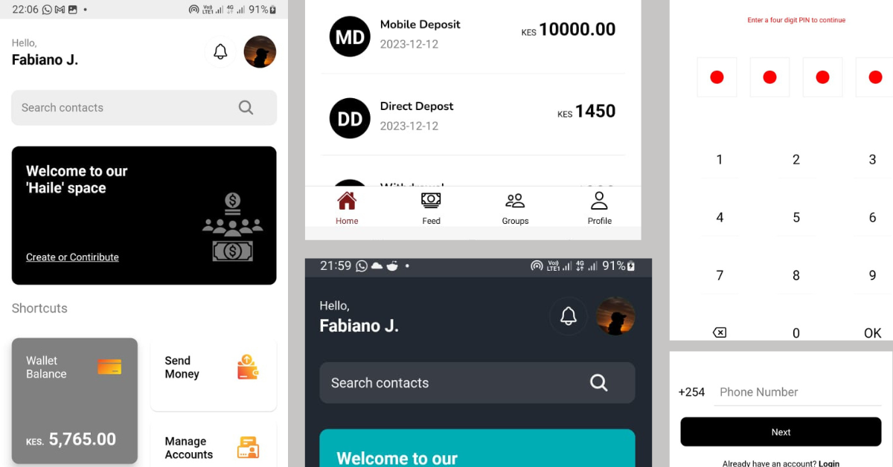

  <a href="https://github.com/ShaanCoding/ReadME-Generator">
    <!--  -->
    
  </a>

  <h3 align="center">Hailespace</h3>

  

    Welcome to Hailespace – your one-stop fintech solution for seamless money transfers across countries in Africa. Powered by Flutterwave and Mpesa Daraja APIs, Hailespace revolutionizes the way users send and receive money, offering convenience and efficiency like never before.
     
     
    <a href="https://github.com/Judefabi/hailespace_public"><strong>View Demo »</strong></a>
     
     
    <a href="https://github.com/Judefabi/hailespace_public">Explore the docs</a>
    .
    <a href="https://github.com/Judefabi/hailespace_public/issues">Report Bug</a>
    .
    <a href="https://github.com/Judefabi/hailespace_public/issues">Request Feature</a>
  

      

## Table Of Contents

- [Table Of Contents](#table-of-contents)
- [About The Project](#about-the-project)
- [Features](#features)
- [Tech Stack](#tech-stack)
- [Getting Started](#getting-started)
  - [Cloning](#cloning)
  - [Installation](#installation)
  - [Usage](#usage)
- [Contributing](#contributing)
  - [Creating A Pull Request](#creating-a-pull-request)
- [License](#license)
- [Author](#author)
- [Acknowledgements](#acknowledgements)

## About The Project

Hailespace is your ultimate fintech solution, designed to simplify money transfers across African countries. By leveraging the power of Flutterwave and Mpesa Daraja APIs, Hailespace enables users to send and receive money with ease, transcending geographical boundaries and financial barriers. With a user-friendly interface and robust functionality, Hailespace sets a new standard in cross-border payments.

## Features

- **Seamless Money Transfers:** Send and receive money effortlessly across countries in Africa.
- **Integration with Leading Payment Platforms:** Utilize Flutterwave and Mpesa Daraja APIs for secure and reliable transactions.
- **Convenience and Efficiency:** Enjoy a streamlined money transfer experience, saving time and effort.
- **Future Expansion:** Stay tuned for upcoming features, including mobile payments, card payments, and bank transfers.

## Tech Stack

- **Frontend:** React Native, Javascript
- **Backend:** Python, Fast API
- **Database:** PostgreSQL
- **Containerization:** Docker
- **Payment APIs:** Flutterwave API, Mpesa Daraja API

## Getting Started

### Cloning

This project is done under hailespace LTD, Kenya and is still in development thus the code is not available for now and its only for purposes of showcasing in my portfolio. Stay tuned to when an open version of this code will be available. For now, hope you like the demosS

### Usage

Once you have cloned the repository and installed the dependencies, you can start using Hailespace in your development environment.

## Contributing

Contributions are welcome and appreciated! Here's how you can contribute:

### Creating A Pull Request

1. Fork the Project
2. Create your Feature Branch (`git checkout -b feature/AmazingFeature`)
3. Commit your Changes (`git commit -m 'Add some AmazingFeature'`)
4. Push to the Branch (`git push origin feature/AmazingFeature`)
5. Open a Pull Request

## License

Distributed under the MPL-2.0 License. See [LICENSE](https://github.com/Judefabi/hailespace_public/blob/main/LICENSE.md) for more information.

## Author

- **Jude Fabiano** - _Software Developer_ - [@Judefabi](https://github.com/judefabi/) - _Hailespace LTD_

## Acknowledgements

- [ShaanCoding](https://github.com/ShaanCoding/)
- [Flutterwave](https://flutterwave.com/)
- [Mpesa Daraja API](https://developer.safaricom.co.ke/)
